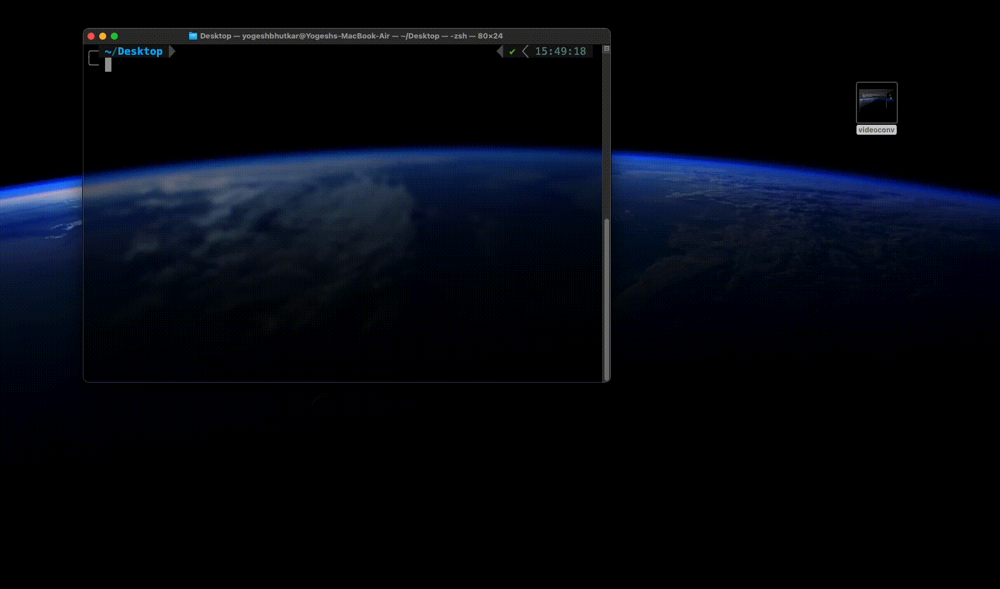

# VideoConv



A powerful CLI tool built with Go and FFmpeg for converting video files between different formats.

## Features

- Convert videos between various formats (MOV, MP4, GIF, etc.)
- Customize output settings:
  - Frame rate (FPS)
  - Quality
  - Resolution
  - Output filename
- Simple and intuitive command-line interface
- Cross-platform support (macOS, Linux, Windows)

## Installation

### Prerequisites

- Go 1.16 or higher
- FFmpeg installed on your system

```bash
# macOS (using Homebrew)
brew install ffmpeg

# Linux
sudo apt-get install ffmpeg

# Windows (using Chocolatey)
choco install ffmpeg
```

### Install VideoConv (with brew)

```bash

# Add the tap
brew tap yogeshbhutkar/tools
```

```bash

# Install the CLI
brew install videoconv
```

## Usage

Basic conversion:
```bash
videoconv convert -i input.mov -o output.gif
```

Advanced options:
```bash
videoconv convert -i input.mov -o output.gif -f 15 -q 20 -s 640x480
```

### Available Commands

```bash
videoconv convert [flags]
```

### Flags

- `-i, --input`: Input file path (required)
- `-o, --output`: Output file path (optional, defaults to "output.[ext]")
- `-f, --fps`: Frames per second (optional, defaults to source fps)
- `-q, --quality`: Output quality (optional, 1-31, lower is better)
- `-s, --size`: Output resolution (optional, format: WxH)

## Examples

1. Convert MOV to GIF with default settings:
```bash
videoconv convert -i video.mov -o animation.gif
```

2. Convert with custom FPS and quality:
```bash
videoconv convert -i video.mov -o animation.gif -f 15 -q 20
```

3. Convert with specific resolution:
```bash
videoconv convert -i video.mov -o animation.gif -s 640x480
```

## Contributing

1. Fork the repository
2. Create your feature branch (`git checkout -b feature/amazing-feature`)
3. Commit your changes (`git commit -m 'Add some amazing feature'`)
4. Push to the branch (`git push origin feature/amazing-feature`)
5. Open a Pull Request

## License

This project is licensed under the MIT License - see the [LICENSE](LICENSE) file for details.

## Acknowledgments

- Built with [Cobra](https://github.com/spf13/cobra)
- Powered by [FFmpeg](https://ffmpeg.org/)